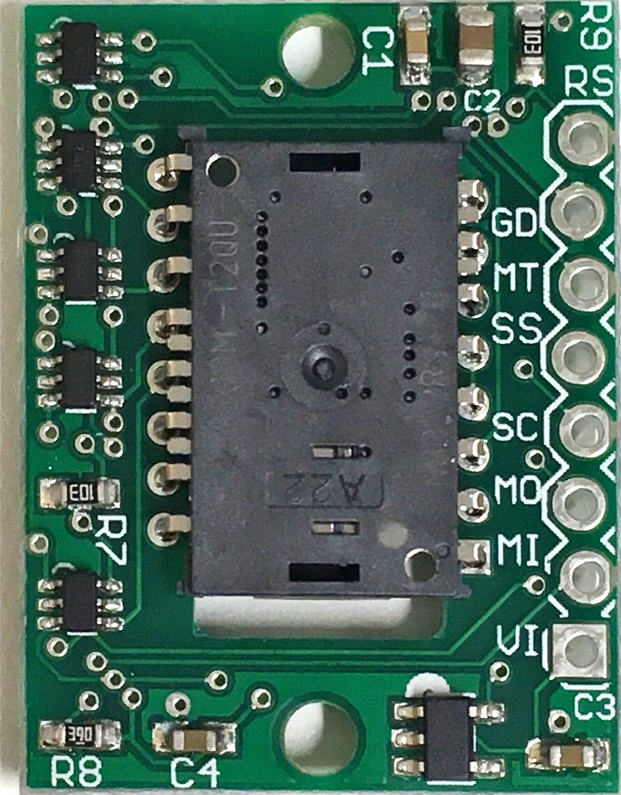

# PMW3360_Arduino
Interfacing PixArt PMW3360 with ATMega32u4 based Arduino boards

# Parts info
* PMW3360 Module: https://www.tindie.com/products/jkicklighter/pmw3360-motion-sensor/ by JACK Enterprises
  * 
* Base source code: https://github.com/mrjohnk/PMW3360DM-T2QU by mrjohnk
* Arduino Pro Micro: https://www.sparkfun.com/products/12640
  * It's compatible with Arduino Micro, Arduino Leonardo
  * Arduino Micro: https://store.arduino.cc/arduino-micro
  * Arduino Leonardo: https://www.arduino.cc/en/Main/Arduino_BoardLeonardo
  * (Theoretically possible, but not tested) Teensy 2.0 (https://www.pjrc.com/store/teensy.html) with Teensyduino (https://www.pjrc.com/teensy/teensyduino.html)

# Pin connection
* MI = MISO
* MO = MOSI
* SS = Slave Select / Chip Select
* SC = SPI Clock
* MT = Motion (active low interrupt line)
* RS = Reset
* GD = Ground
* VI = Voltage in up to +5.5V

```
[Module] --- [Arduino]
      RS --- (NONE)
      GD --- GND
      MT --- Pin 7 (PE6, INT6) -> movement interrupt
      SS --- Pin 10 (PB6)
      SC --- SCK (PB1)
      MO --- MOSI (PB2)
      MI --- MISO (PB3)
      VI --- 5V

// in Mouse example
[Button] --- [Arduino]
    Left --- Pin 1 (PD3, INT3)
   Right --- Pin 0 (PD2, INT2)
   
* Connect the other pole of a button to GND
```

# Sketch Descriptions
* PMW3360DM-Burst/
  * Minimal example for burst read on PMW3360 sensor
  * displacement in X and Y axis are printed when a motion is detected.
  * Serial Plotter is a nice way to visualize the result.
* PMW3360DM-Mouse/
  * Fully functional mouse (w. 1k polling rate) example with two buttons (left, right)
  * Default CPI and debounce time can be set (see #define sections in the source code)
  * Commands (newline (\n) should be placed at the end of each command)
    * Q: toggle surface quality report (can be seen thorugh Serial Monitor or Serial Plotter)
    * I: print device signature
    * C[number]: Set cpi level, example) C1600\n   = set CPI to 1600.
* PMW3360DM-Camera/
  * See raw image captured from the sensor.
  * It outputs 1297 numbers in a plain text (dilimited by space character ' ')
    * [0] -- [1295]: 36x36 array of sensor image
    * [1296]: Surface quality value
  * A GUI version visualizer (PMW3360DM_Camera_Viewer/) is implemented on Processing (http://processing.org). 
* (Legacy) Module/Arduino Examples/
  * Examples provided by https://github.com/mrjohnk/PMW3360DM-T2QU

# How to use
  * Build the circuit as described.
  * Load one of the desired skectch on Arduino IDE.
    * For PMW3360DM-Camera sketch, load PMW3360DM_Camera_Viewer sketch on Processing and run.
    
# Wishlist
 * Test with ARM-based 32bit boards
 * Deal with the scroll wheel encoder
 * 16-bit mouse report (https://www.overclock.net/forum/375-mice/1561041-reverse-engineering-3366-a-35.html#post26314321)

# Example construction
  * 
  * 
